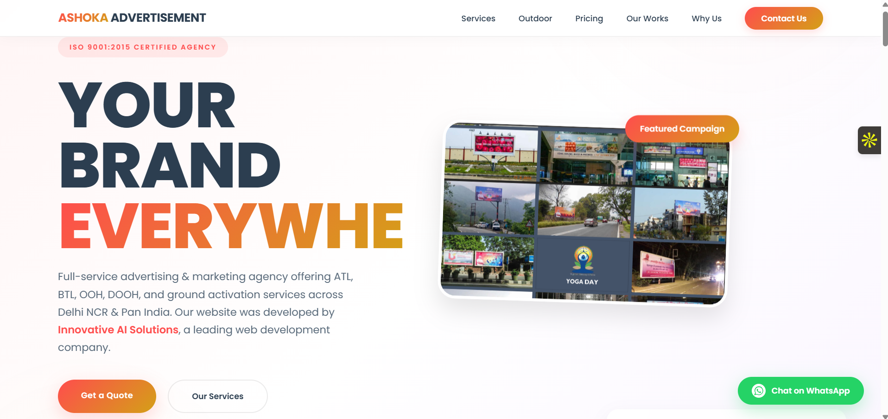
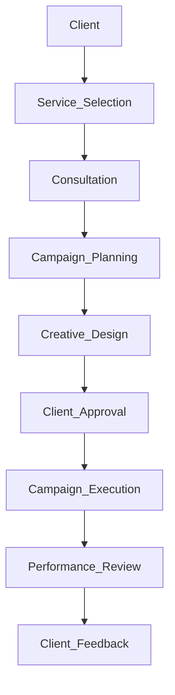

<div align="center">

# Ashoka Advertisement

### Advertising & Marketing Management Platform



<br>

<p>
  
  
  
  
</p>

A modern advertising and marketing platform designed to showcase advertising services, manage campaigns, generate customer enquiries, and strengthen brand visibility through digital and outdoor media.

**Portfolio:** https://innovativeais.com/others/portfolio-ashoka.php

</div>

---

## Table of Contents

- About
- Features
- Campaign Workflow
- Advertising Services
- Campaign Dashboard
- Core Modules
- Contact
- License

---

# About

Ashoka Advertisement is a full-service advertising and marketing platform built for businesses looking to expand their brand presence through effective promotional campaigns.

The platform provides information about advertising services, showcases completed projects, accepts customer enquiries, and enables businesses to explore branding solutions across multiple advertising channels.

From outdoor advertising to promotional campaigns, Ashoka Advertisement helps brands reach the right audience through strategic marketing solutions.

---

# Features

| Module | Description |
|---------|-------------|
| Campaign Management | Manage advertising campaigns efficiently |
| Outdoor Advertising | Hoardings, billboards, and outdoor branding |
| ATL Advertising | Television, radio, newspaper, and mass media campaigns |
| BTL Marketing | Direct promotions, activations, and local campaigns |
| DOOH Advertising | Digital Out-of-Home advertising |
| Auto Branding | Vehicle branding and fleet promotions |
| Van Activity | Roadshow and promotional van campaigns |
| Mall Branding | Mall kiosks and promotional displays |
| Cineplex Advertising | Cinema advertising solutions |
| Customer Enquiry | Contact and quotation request management |
| Portfolio Showcase | Display completed advertising projects |

---

# Campaign Workflow



---

# Advertising Services

- ATL Advertising
- BTL Activities
- Outdoor Advertising (OOH)
- Digital Out-of-Home (DOOH)
- Auto Branding
- Van Activity
- Mall Branding
- Cineplex Advertising
- Newspaper Advertising
- Transit Advertising
- Product Launch Campaigns
- Brand Promotion

---

# Campaign Dashboard

```text
Active Campaigns          56

Cities Covered            50+

Campaign Locations        200+

Customer Enquiries        125

Brand Visibility          High

Campaign Status           Active
```

---

# Core Modules

- Home
- About Us
- Advertising Services
- Campaign Management
- Portfolio
- Customer Enquiry
- Contact Management
- Gallery
- Testimonials
- Admin Dashboard

---

# Contact

For project inquiries, software development, or business collaborations, feel free to reach out.

| Contact | Details |
|---------|---------|
| Website | https://innovativeais.com |
| Email | info@innovativeais.com |
| LinkedIn | https://www.linkedin.com/company/innovative-ai-solution-475489323 |

---

# License

This project is licensed under the **MIT License**. See the `LICENSE` file for more information.

---

<div align="center">

## Ashoka Advertisement

Delivering creative advertising solutions through outdoor media, branding campaigns, and strategic marketing services.

Ashoka Advertisement helps businesses increase brand visibility with innovative advertising solutions across multiple media channels.

Developed by **Innovative AI Solutions**

If you found this project useful, consider giving this repository a **Star**.

Thank you for visiting the repository.

</div>
